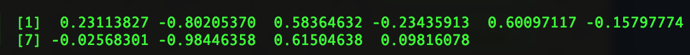

# R-DataScience

### Getting Started
El `[1]` significa que es el primer elemento.
Si hubieran dos filas en la consola, y tocara mostrar en el sig. renglón el 7mo elemento, veriamos un `[7]`, como en el sig. ejemplo.

 

Ejecutamos un archivo **R**, con `source`:
 
``` R
source("/Users/richie/Desktop/hello.r")
```

### Vectors
Crear un vector simple con los elementos 1, 2 y 4.
La **c** indica *concatenar*, entonces aqui estamos concatenando 1, 2 y 4.

```R
x <- c(1,2,4)
```
Intentemos lo siguiente, concatenar *x* dos veces.

```R
x <- c(x,x,8)
```
La salida es:

```R
[1] 1 2 4 1 2 4 8
```

Para acceder a elementos del vector usamos corchetes **[ ]**, indicando el índice enmedio o bien un subvector, ej. 2:3.

```R
x[3]   #imprime a la salida: [1] 4
x[2:3] #imprime a la salida: [1] 2 4
```

Podemos calcular la *media* `mean(x)` o *desviación estandard* `sd(x)`.

```R
> mean(x)
[1] 2.333333
> sd(x)
[1] 1.527525
```

Y asignarla a otra variable.

```R
y <- mean(x)
```

### Cerrando el Workspace
Tecleamos `q()`.

>If you answer **y**, then all those objects will be loaded automatically the next time you run R. This is a very important fea- ture, especially when working with large or numerous data sets. Answering y here also saves the session’s command history. 


### Funciones


